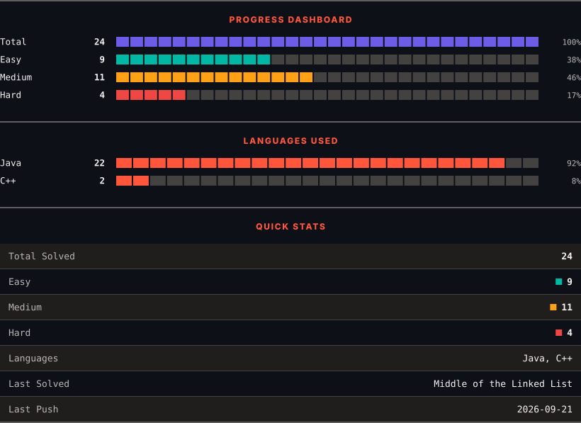

<h1>LeetCode Solutions</h1>

<em>Automatically synced with every accepted submission</em>

   

<picture>
  <source media="(prefers-color-scheme: dark)" srcset=".leetsync/stats-dark.svg">
  <source media="(prefers-color-scheme: light)" srcset=".leetsync/stats-light.svg">
  
</picture>

## 📚 All Solutions

| # | Problem | Difficulty | Language | Date |
|:---:|---------|:----------:|:--------:|:----:|
| 1 | [Two Sum](problems/0001-Two-Sum) | 🟢 Easy | `Java` | 2026-09-02 |
| 11 | [Container With Most Water](problems/0011-Container-With-Most-Water) | 🟡 Medium | `C++` | 2026-09-02 |

---

🤖 Auto-synced by <strong>LeetSync</strong> Chrome Extension

Built with ❤️ by <a href="https://deveshsamant.in/">Devesh Samant</a>

