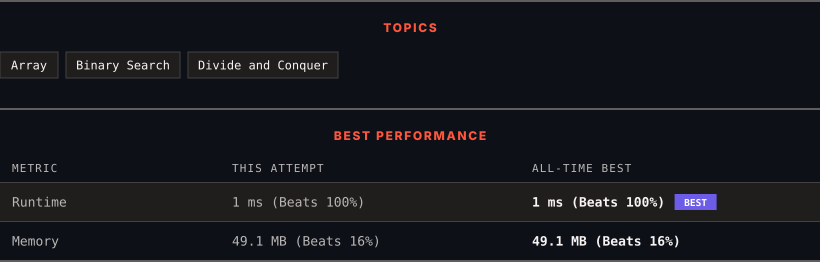

<div align="center">

# 4. Median of Two Sorted Arrays

      

[](https://leetcode.com/problems/median-of-two-sorted-arrays/)

</div>

---

<div align="center">

<picture>
  <source media="(prefers-color-scheme: dark)" srcset="panel-dark.svg">
  <source media="(prefers-color-scheme: light)" srcset="panel-light.svg">
  
</picture>

</div>

> **New personal best** — Runtime improved on this submission.

### HOW IT WENT

| | |
|:--|:--|
| **Attempts** | first try |
| **Time to solve** | 21 min |
| **Verdicts** | ✅ Accepted |

---

### NOTES

_No notes yet._

---

### SOLUTIONS (1)

| # | File | Language | Date |
|:-:|------|:--------:|:----:|
| 1 | [sol1.java](./sol1.java) | `Java` | 2026-09-13 ← **latest** |

---

### PROBLEM DESCRIPTION

Given two sorted arrays `nums1` and `nums2` of size `m` and `n` respectively, return **the median** of the two sorted arrays.

The overall run time complexity should be `O(log (m+n))`.

 

**Example 1:**

```

**Input:** nums1 = [1,3], nums2 = [2]
**Output:** 2.00000
**Explanation:** merged array = [1,2,3] and median is 2.

```

**Example 2:**

```

**Input:** nums1 = [1,2], nums2 = [3,4]
**Output:** 2.50000
**Explanation:** merged array = [1,2,3,4] and median is (2 + 3) / 2 = 2.5.

```

 

**Constraints:**

	- `nums1.length == m`

	- `nums2.length == n`

	- `0 <= m <= 1000`

	- `0 <= n <= 1000`

	- `1 <= m + n <= 2000`

	- `-10^6 <= nums1[i], nums2[i] <= 10^6`

---

<div align="center">

<sub>Auto-synced by <strong>LeetSync</strong> · Built by <a href="https://deveshsamant.in/">Devesh Samant</a></sub>

</div>
