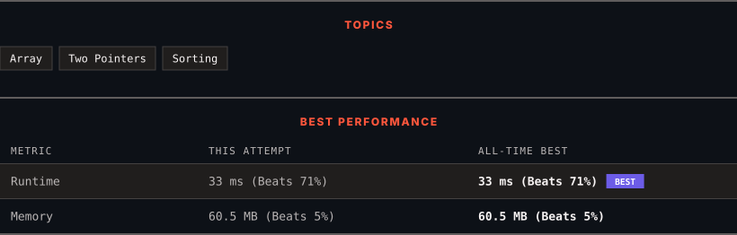

<div align="center">

# 15. 3Sum

      

[](https://leetcode.com/problems/3sum/)

</div>

---

<div align="center">

<picture>
  <source media="(prefers-color-scheme: dark)" srcset="panel-dark.svg">
  <source media="(prefers-color-scheme: light)" srcset="panel-light.svg">
  
</picture>

</div>

> **New personal best** — Runtime improved on this submission.

---

### SOLUTIONS (1)

| # | File | Language | Date |
|:-:|------|:--------:|:----:|
| 1 | [sol1.java](./sol1.java) | `Java` | 2026-09-07 ← **latest** |

---

### PROBLEM DESCRIPTION

Given an integer array nums, return all the triplets `[nums[i], nums[j], nums[k]]` such that `i != j`, `i != k`, and `j != k`, and `nums[i] + nums[j] + nums[k] == 0`.

Notice that the solution set must not contain duplicate triplets.

 

**Example 1:**

```

**Input:** nums = [-1,0,1,2,-1,-4]
**Output:** [[-1,-1,2],[-1,0,1]]
**Explanation:** 
nums[0] + nums[1] + nums[2] = (-1) + 0 + 1 = 0.
nums[1] + nums[2] + nums[4] = 0 + 1 + (-1) = 0.
nums[0] + nums[3] + nums[4] = (-1) + 2 + (-1) = 0.
The distinct triplets are [-1,0,1] and [-1,-1,2].
Notice that the order of the output and the order of the triplets does not matter.

```

**Example 2:**

```

**Input:** nums = [0,1,1]
**Output:** []
**Explanation:** The only possible triplet does not sum up to 0.

```

**Example 3:**

```

**Input:** nums = [0,0,0]
**Output:** [[0,0,0]]
**Explanation:** The only possible triplet sums up to 0.

```

 

**Constraints:**

	- `3 <= nums.length <= 3000`

	- `-10^5 <= nums[i] <= 10^5`

---

<div align="center">

<sub>Auto-synced by <strong>LeetSync</strong> · Built by <a href="https://deveshsamant.in/">Devesh Samant</a></sub>

</div>
