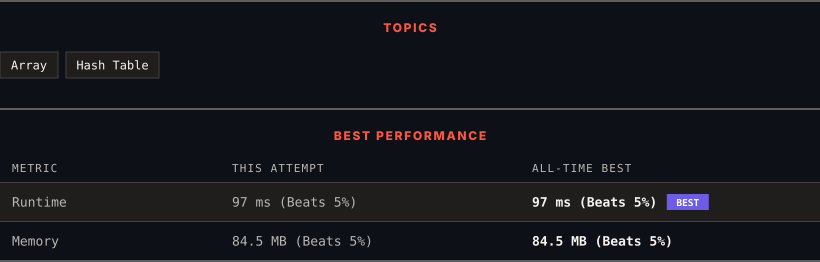

<div align="center">

# 41. First Missing Positive

      

[](https://leetcode.com/problems/first-missing-positive/)

</div>

---

<div align="center">

<picture>
  <source media="(prefers-color-scheme: dark)" srcset="panel-dark.svg">
  <source media="(prefers-color-scheme: light)" srcset="panel-light.svg">
  
</picture>

</div>

---

### SOLUTIONS (3)

| # | File | Language | Date |
|:-:|------|:--------:|:----:|
| 1 | [sol1.cpp](./sol1.cpp) | `C++` | 2026-09-03 |
| 2 | [sol2.cpp](./sol2.cpp) | `C++` | 2026-09-03 |
| 3 | [sol3.cpp](./sol3.cpp) | `C++` | 2026-09-03 ← **latest** |

---

### PROBLEM DESCRIPTION

Given an unsorted integer array `nums`. Return the *smallest positive integer* that is *not present* in `nums`.

You must implement an algorithm that runs in `O(n)` time and uses `O(1)` auxiliary space.

 

**Example 1:**

```

**Input:** nums = [1,2,0]
**Output:** 3
**Explanation:** The numbers in the range [1,2] are all in the array.

```

**Example 2:**

```

**Input:** nums = [3,4,-1,1]
**Output:** 2
**Explanation:** 1 is in the array but 2 is missing.

```

**Example 3:**

```

**Input:** nums = [7,8,9,11,12]
**Output:** 1
**Explanation:** The smallest positive integer 1 is missing.

```

 

**Constraints:**

	- `1 <= nums.length <= 10^5`

	- `-2^31 <= nums[i] <= 2^31 - 1`

---

<div align="center">

<sub>Auto-synced by <strong>LeetSync</strong> · Built by <a href="https://deveshsamant.in/">Devesh Samant</a></sub>

</div>
