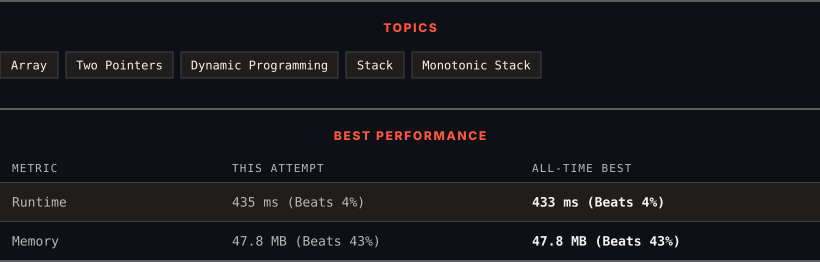

<div align="center">

# 42. Trapping Rain Water

      

[](https://leetcode.com/problems/trapping-rain-water/)

</div>

---

<div align="center">

<picture>
  <source media="(prefers-color-scheme: dark)" srcset="panel-dark.svg">
  <source media="(prefers-color-scheme: light)" srcset="panel-light.svg">
  
</picture>

</div>

> **New personal best** — Runtime improved on this submission.

---

### SOLUTIONS (1)

| # | File | Language | Date |
|:-:|------|:--------:|:----:|
| 1 | [sol1.java](./sol1.java) | `Java` | 2026-09-08 ← **latest** |

---

### PROBLEM DESCRIPTION

Given `n` non-negative integers representing an elevation map where the width of each bar is `1`, compute how much water it can trap after raining.

 

**Example 1:**


```

**Input:** height = [0,1,0,2,1,0,1,3,2,1,2,1]
**Output:** 6
**Explanation:** The above elevation map (black section) is represented by array [0,1,0,2,1,0,1,3,2,1,2,1]. In this case, 6 units of rain water (blue section) are being trapped.

```

**Example 2:**

```

**Input:** height = [4,2,0,3,2,5]
**Output:** 9

```

 

**Constraints:**

	- `n == height.length`

	- `1 <= n <= 2 * 10^4`

	- `0 <= height[i] <= 10^5`

---

<div align="center">

<sub>Auto-synced by <strong>LeetSync</strong> · Built by <a href="https://deveshsamant.in/">Devesh Samant</a></sub>

</div>
