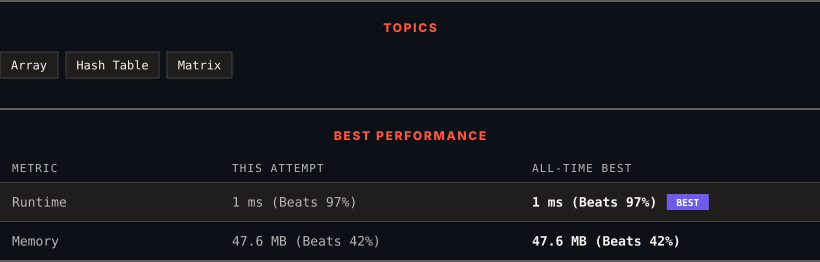

<div align="center">

# 73. Set Matrix Zeroes

      

[](https://leetcode.com/problems/set-matrix-zeroes/)

</div>

---

<div align="center">

<picture>
  <source media="(prefers-color-scheme: dark)" srcset="panel-dark.svg">
  <source media="(prefers-color-scheme: light)" srcset="panel-light.svg">
  
</picture>

</div>

> **New personal best** — Runtime improved on this submission.

---

### SOLUTIONS (1)

| # | File | Language | Date |
|:-:|------|:--------:|:----:|
| 1 | [sol1.java](./sol1.java) | `Java` | 2026-09-05 ← **latest** |

---

### PROBLEM DESCRIPTION

Given an `m x n` integer matrix `matrix`, if an element is `0`, set its entire row and column to `0`'s.

You must do it [in place](https://en.wikipedia.org/wiki/In-place_algorithm).

 

**Example 1:**


```

**Input:** matrix = [[1,1,1],[1,0,1],[1,1,1]]
**Output:** [[1,0,1],[0,0,0],[1,0,1]]

```

**Example 2:**


```

**Input:** matrix = [[0,1,2,0],[3,4,5,2],[1,3,1,5]]
**Output:** [[0,0,0,0],[0,4,5,0],[0,3,1,0]]

```

 

**Constraints:**

	- `m == matrix.length`

	- `n == matrix[0].length`

	- `1 <= m, n <= 200`

	- `-2^31 <= matrix[i][j] <= 2^31 - 1`

 

**Follow up:**

	- A straightforward solution using `O(mn)` space is probably a bad idea.

	- A simple improvement uses `O(m + n)` space, but still not the best solution.

	- Could you devise a constant space solution?

---

<div align="center">

<sub>Auto-synced by <strong>LeetSync</strong> · Built by <a href="https://deveshsamant.in/">Devesh Samant</a></sub>

</div>
