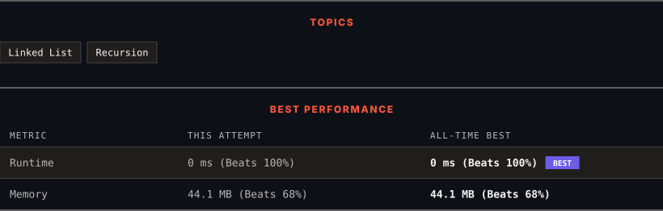

<div align="center">

# 206. Reverse Linked List

      

[](https://leetcode.com/problems/reverse-linked-list/)

</div>

---

<div align="center">

<picture>
  <source media="(prefers-color-scheme: dark)" srcset="panel-dark.svg">
  <source media="(prefers-color-scheme: light)" srcset="panel-light.svg">
  
</picture>

</div>

> **New personal best** — Runtime improved on this submission.

---

### SOLUTIONS (1)

| # | File | Language | Date |
|:-:|------|:--------:|:----:|
| 1 | [sol1.java](./sol1.java) | `Java` | 2026-09-06 ← **latest** |

---

### PROBLEM DESCRIPTION

Given the `head` of a singly linked list, reverse the list, and return *the reversed list*.

 

**Example 1:**


```

**Input:** head = [1,2,3,4,5]
**Output:** [5,4,3,2,1]

```

**Example 2:**


```

**Input:** head = [1,2]
**Output:** [2,1]

```

**Example 3:**

```

**Input:** head = []
**Output:** []

```

 

**Constraints:**

	- The number of nodes in the list is the range `[0, 5000]`.

	- `-5000 <= Node.val <= 5000`

 

**Follow up:** A linked list can be reversed either iteratively or recursively. Could you implement both?

---

<div align="center">

<sub>Auto-synced by <strong>LeetSync</strong> · Built by <a href="https://deveshsamant.in/">Devesh Samant</a></sub>

</div>
