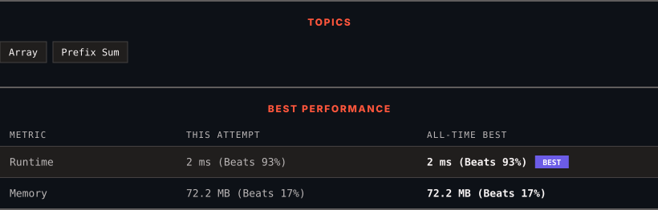

<div align="center">

# 238. Product of Array Except Self

      

[](https://leetcode.com/problems/product-of-array-except-self/)

</div>

---

<div align="center">

<picture>
  <source media="(prefers-color-scheme: dark)" srcset="panel-dark.svg">
  <source media="(prefers-color-scheme: light)" srcset="panel-light.svg">
  
</picture>

</div>

> **New personal best** — Runtime improved on this submission.

### HOW IT WENT

| | |
|:--|:--|
| **Attempts** | first try |
| **Time to solve** | 30 min |
| **Verdicts** | ✅ Accepted |

---

### NOTES

_No notes yet._

---

### SOLUTIONS (1)

| # | File | Language | Date |
|:-:|------|:--------:|:----:|
| 1 | [sol1.java](./sol1.java) | `Java` | 2026-09-13 ← **latest** |

---

### PROBLEM DESCRIPTION

Given an integer array `nums`, return *an array* `answer` *such that* `answer[i]` *is equal to the product of all the elements of* `nums` *except* `nums[i]`.

The product of any prefix or suffix of `nums` is **guaranteed** to fit in a **32-bit** integer.

You must write an algorithm that runs in `O(n)` time and without using the division operation.

 

**Example 1:**

```
**Input:** nums = [1,2,3,4]
**Output:** [24,12,8,6]

```

**Example 2:**

```
**Input:** nums = [-1,1,0,-3,3]
**Output:** [0,0,9,0,0]

```

 

**Constraints:**

	- `2 <= nums.length <= 10^5`

	- `-30 <= nums[i] <= 30`

	- The input is generated such that `answer[i]` is **guaranteed** to fit in a **32-bit** integer.

 

**Follow up:** Can you solve the problem in `O(1)` extra space complexity? (The output array **does not** count as extra space for space complexity analysis.)

---

<div align="center">

<sub>Auto-synced by <strong>LeetSync</strong> · Built by <a href="https://deveshsamant.in/">Devesh Samant</a></sub>

</div>
