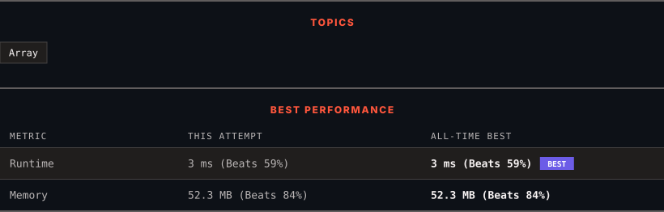

<div align="center">

# 485. Max Consecutive Ones

      

[](https://leetcode.com/problems/max-consecutive-ones/)

</div>

---

<div align="center">

<picture>
  <source media="(prefers-color-scheme: dark)" srcset="panel-dark.svg">
  <source media="(prefers-color-scheme: light)" srcset="panel-light.svg">
  
</picture>

</div>

> **New personal best** — Runtime improved on this submission.

---

### SOLUTIONS (1)

| # | File | Language | Date |
|:-:|------|:--------:|:----:|
| 1 | [sol1.java](./sol1.java) | `Java` | 2026-09-08 ← **latest** |

---

### PROBLEM DESCRIPTION

Given a binary array `nums`, return *the maximum number of consecutive *`1`*'s in the array*.

 

**Example 1:**

```

**Input:** nums = [1,1,0,1,1,1]
**Output:** 3
**Explanation:** The first two digits or the last three digits are consecutive 1s. The maximum number of consecutive 1s is 3.

```

**Example 2:**

```

**Input:** nums = [1,0,1,1,0,1]
**Output:** 2

```

 

**Constraints:**

	- `1 <= nums.length <= 10^5`

	- `nums[i]` is either `0` or `1`.

---

<div align="center">

<sub>Auto-synced by <strong>LeetSync</strong> · Built by <a href="https://deveshsamant.in/">Devesh Samant</a></sub>

</div>
