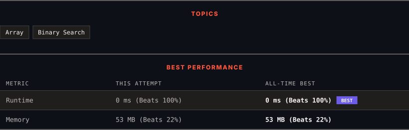

<div align="center">

# 540. Single Element in a Sorted Array

      

[](https://leetcode.com/problems/single-element-in-a-sorted-array/)

</div>

---

<div align="center">

<picture>
  <source media="(prefers-color-scheme: dark)" srcset="panel-dark.svg">
  <source media="(prefers-color-scheme: light)" srcset="panel-light.svg">
  
</picture>

</div>

> **New personal best** — Runtime improved on this submission.

### HOW IT WENT

| | |
|:--|:--|
| **Attempts** | 2 before accepted |
| **Time to solve** | 26 min |
| **Verdicts** | ✅ Accepted → ✅ Accepted |

---

### NOTES

_No notes yet._

---

### SOLUTIONS (2)

| # | File | Language | Date |
|:-:|------|:--------:|:----:|
| 1 | [sol1.java](./sol1.java) | `Java` | 2026-09-12 |
| 2 | [sol2.java](./sol2.java) | `Java` | 2026-09-12 ← **latest** |

---

### PROBLEM DESCRIPTION

You are given a sorted array consisting of only integers where every element appears exactly twice, except for one element which appears exactly once.

Return *the single element that appears only once*.

Your solution must run in `O(log n)` time and `O(1)` space.

 

**Example 1:**

```
**Input:** nums = [1,1,2,3,3,4,4,8,8]
**Output:** 2

```

**Example 2:**

```
**Input:** nums = [3,3,7,7,10,11,11]
**Output:** 10

```

 

**Constraints:**

	- `1 <= nums.length <= 10^5`

	- `0 <= nums[i] <= 10^5`

---

<div align="center">

<sub>Auto-synced by <strong>LeetSync</strong> · Built by <a href="https://deveshsamant.in/">Devesh Samant</a></sub>

</div>
