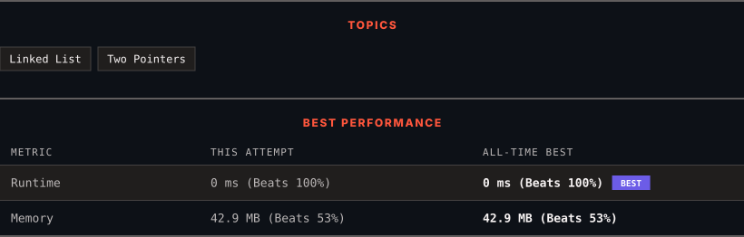

<div align="center">

# 876. Middle of the Linked List

      

[](https://leetcode.com/problems/middle-of-the-linked-list/)

</div>

---

<div align="center">

<picture>
  <source media="(prefers-color-scheme: dark)" srcset="panel-dark.svg">
  <source media="(prefers-color-scheme: light)" srcset="panel-light.svg">
  
</picture>

</div>

> **New personal best** — Runtime improved on this submission.

---

### SOLUTIONS (1)

| # | File | Language | Date |
|:-:|------|:--------:|:----:|
| 1 | [sol1.java](./sol1.java) | `Java` | 2026-09-06 ← **latest** |

---

### PROBLEM DESCRIPTION

Given the `head` of a singly linked list, return *the middle node of the linked list*.

If there are two middle nodes, return **the second middle** node.

 

**Example 1:**


```

**Input:** head = [1,2,3,4,5]
**Output:** [3,4,5]
**Explanation:** The middle node of the list is node 3.

```

**Example 2:**


```

**Input:** head = [1,2,3,4,5,6]
**Output:** [4,5,6]
**Explanation:** Since the list has two middle nodes with values 3 and 4, we return the second one.

```

 

**Constraints:**

	- The number of nodes in the list is in the range `[1, 100]`.

	- `1 <= Node.val <= 100`

---

<div align="center">

<sub>Auto-synced by <strong>LeetSync</strong> · Built by <a href="https://deveshsamant.in/">Devesh Samant</a></sub>

</div>
